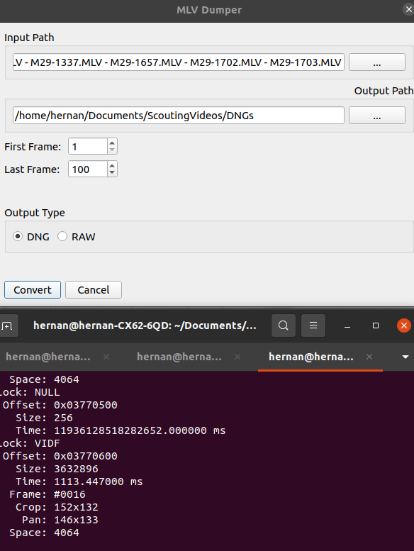
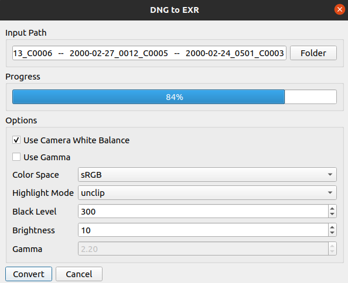

## MLV_app

This is a very simple wrapper of the great *mlv_dump* tool made by the guys at magic lanter.


Make sure you update the constants.py file variable **MLV** to point to your mlv_dump file on disk

```
MLV = "./mlv/mlv_dump"
```

#### MLV Dump Window



### Work in progress DNG to EXR

This tool converts **DNG** to **EXR** using the next command line tools

  * dcraw (http://www.guillermoluijk.com/tutorial/dcraw/index_en.htm)
 
  * imagemagick (https://www.lifewire.com/convert-linux-command-unix-command-4097060)


install **dcraw** by
```
sudo apt-get update -y
sudo apt-get install -y dcraw
```

 install **imagemagick** by
``` 
sudo apt install imagemagick
```

####  DNG to EXR window

